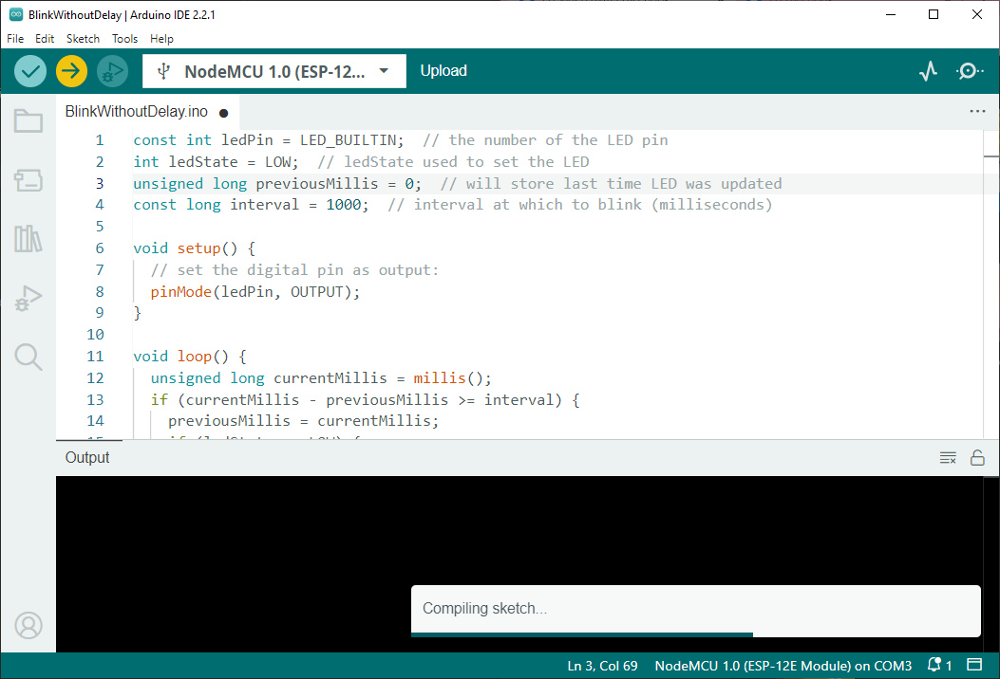
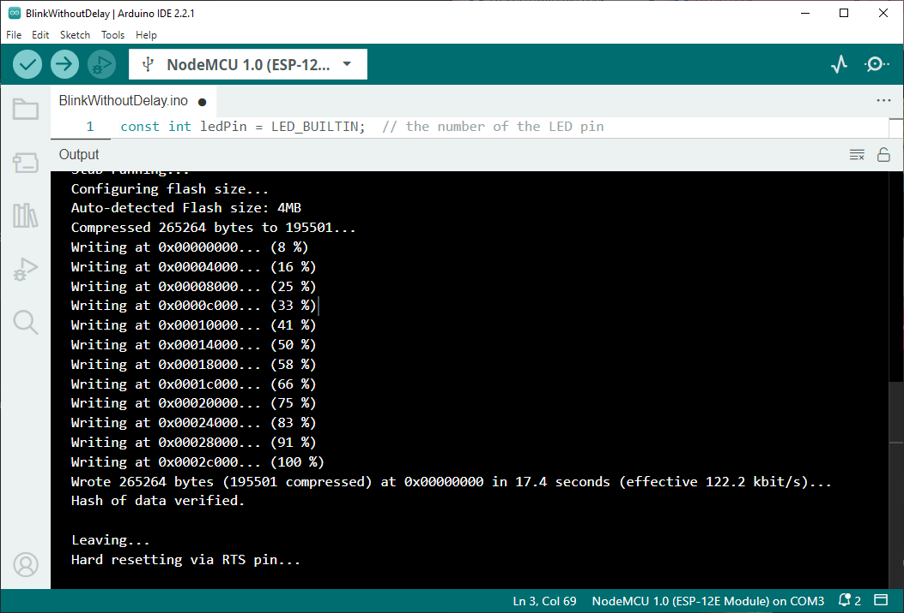

# Cara menggunakan ESP8266 di Arduino IDE
## Alat
* Sebuah Komputer atau Laptop
* Arduino IDE versi: 2.2.1\


## Bahan
* sebuah micro controller : Esp8266\


## Langkah
1. buka `Arduino IDE` di komputer atau laptop
2. hubungkan Esp8266 dengan komputer 
3. buka `device manager` dengan cara
    ```
    klik kanan Windows 
        > Pilih: Device Manager 
            > Unminimize: HOSTNAME 
                > Ports(COM & LPT)
    ```
    
4. perhatikan pada list Ports (COM & LPT)\
    contoh:
    ```
    Silicon Labs CP210x USB to UART Bridge (COM3)
    ```
5. pada Arduino IDE pilih (COM3) sesuai Port list yang tertampil di `device manager`\

6. cari dan sesuaikan dengan board mikro kontroler yang kita miliki\

7. coba memulai coding dengan menulis baris perintah sederhana\

8. lakukan upload program ke mikro kontroler

9. hasil upload atau flashing

10. hasil coding yang telah dibuat yaitu program sederhana untuk menghidupkan dan mematikan lampu\
<video src='ss/hasil coding.mp4' controls="controls"></video>


## Contoh Program
### Menghidupkan dan Mematikan Lampu
```cpp
const int ledPin = LED_BUILTIN;  // the number of the LED pin
int ledState = LOW;  // ledState used to set the LED
unsigned long previousMillis = 0;  // will store last time LED was updated
const long interval = 1000;  // interval at which to blink (milliseconds)

void setup() {
   pinMode(ledPin, OUTPUT);
}

void loop() {
   unsigned long currentMillis = millis();
   if (currentMillis - previousMillis >= interval) {
      previousMillis = currentMillis;
      if (ledState == LOW) {
         ledState = HIGH;
      } else {
         ledState = LOW;
      }
      digitalWrite(ledPin, ledState);
   }
}

```

## Artikel Lainnya
* [atur wifi esp8266](/b.%20medium/17-11-2023/atur%20wifi%20esp8266/README.md)

## Referensi
https://github.com/esp8266/Arduino