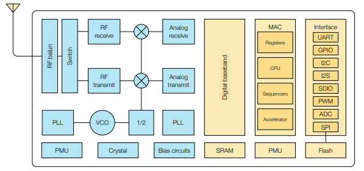
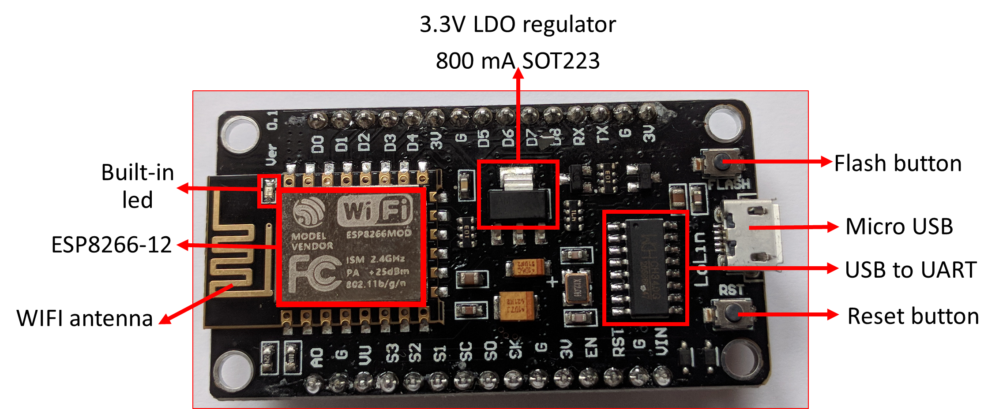

# Cara atur wifi ESP8266

## intro

Apakah kalian tahu bahwa esp-series seperti `esp8266, esp32` dan lainnya sudah terdapat wifi builtin ?

tujuannya adalah untuk memungkinkan antar mikrokontroler ini dapat saling berkomunikasi dengan IP(Internet Protocol) melalui jaringan nirkabel wifi(wireless fidelity)

sangat canggih bukan ? dengan demikian kalian tidak perlu menambahkan modul wireless tambahan untuk memulai project (seperti yang biasa kita lakukan jika hanya menggunakan Arduino Uno atau mikrokontroler sejenis) dimana belum tentu terdapat rangkaian wifi secara builtin seperti mikro kontroler esp8266 [baca selengkapnya tentang espressif](/pustaka/mikrokontroler%20espressif%20kompetitor%20baru%20arduino%20dalam%20industri%20IoT%20dan%20Robotik/README.md)

## Alat
* Sebuah Komputer atau Laptop
* Arduino IDE versi: 2.2.1\

## Bahan
* sebuah micro controller : Esp8266\

## Langkah

## Referensi
https://www.espressif.com/sites/default/files/documentation/0a-esp8266ex_datasheet_en.pdf