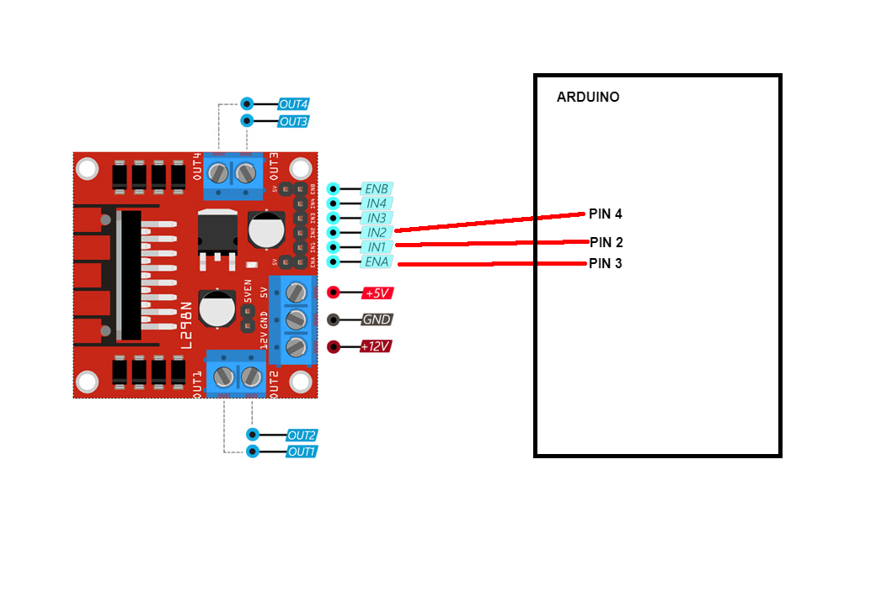

# Cara menggunakan L298N

## Alat
* Sebuah Komputer atau Laptop
* Arduino IDE versi: 2.2.1\


## Bahan
* sebuah micro controller : Esp8266\

* sebuah L298N

## SCHEMATIC


## PROGRAM

### DASAR
```cpp
int ENA = 3; // -> pin 3
int IN1 = 2; // -> pin 2
int IN2 = 4; // -> pin 4

void setup() {
  Serial.begin(115200);
  pinMode(ENA, OUTPUT);
  pinMode(IN1, OUTPUT);
  pinMode(IN2, OUTPUT);
  Serial.println("Memulai Test...");
}

void loop() {
  Serial.println("tes putar: ");
  digitalWrite(ENA, HIGH);
  digitalWrite(IN1, HIGH);
  digitalWrite(IN2, LOW);
}

```


### MENGGUNAKAN WEB SERVER
```cpp
#include <ESP8266WiFi.h>
#include <ESP8266WebServer.h>

const char* ssid = "Portal Sransa (Barat)";
const char* password = "SupportSransa1!";

uint8_t status_mesin = LOW;
uint8_t status_laju = HIGH;
int kecepatan = 0;

int ENA = 3;  //4;
int IN1 = 2;  //0;
int IN2 = 4;  //2;

ESP8266WebServer server(80);

String SendHTML(uint8_t mesin,uint8_t laju) {
  String ptr = "<!DOCTYPE html> <html>\n";
  ptr += "<head><meta name=\"viewport\" content=\"width=device-width, initial-scale=1.0, user-scalable=no\">\n";
  ptr += "<title>LED Control</title>\n";
  ptr += "<style>html { font-family: Helvetica; display: inline-block; margin: 0px auto; text-align: center;}\n";
  ptr += "body{margin-top: 50px;} h1 {color: #444444;margin: 50px auto 30px;} h3 {color: #444444;margin-bottom: 50px;}\n";
  ptr += ".button {display: block;width: 80px;background-color: #1abc9c;border: none;color: white;padding: 13px 30px;text-decoration: none;font-size: 25px;margin: 0px auto 35px;cursor: pointer;border-radius: 4px;}\n";
  ptr += ".button-on {background-color: #1abc9c;}\n";
  ptr += ".button-on:active {background-color: #16a085;}\n";
  ptr += ".button-off {background-color: #34495e;}\n";
  ptr += ".button-off:active {background-color: #2c3e50;}\n";
  ptr += "p {font-size: 14px;color: #888;margin-bottom: 10px;}\n";
  ptr += "</style>\n";

  ptr += "<script>\n\r";
  ptr += "function sendDAC(value){\r\n";
  ptr += "document.getElementById('nilai_rentang').innerHTML=value; \r\n";
  ptr += "server = '/kecepatan?n=' + value;\r\n";
  ptr += "request = new XMLHttpRequest();\r\n";
  ptr += "request.onreadystatechange = updateasyncDac;\r\n";
  ptr += "request.open('ValoreSlider', server, true);\r\n";
  ptr += "request.send(null);\r\n";
  ptr += "}\r\n";
  ptr += "function updateasyncDac(){\r\n";
  ptr += "if ((request.readyState == 4) && (request.status == 200))\r\n";
  ptr += "{\r\n";
  ptr += "}\r\n";
  ptr += "}\r\n";
  ptr += "</script>\r\n";

  ptr += "</head>\n";
  ptr += "<body>\n";
  ptr += "<h1>Atur L298N dengan ESP8266</h1>\n";
  ptr += "<h3>Menggunakan WIFI</h3>\n";

  ptr += "<input type=\"range\" value=\"";
  ptr += kecepatan ;
  ptr += "\" style=\"width: 700px; height: 30px;\" id=\"range_slider\" min=\"0\" max=\"255\" value=\"0\" step=\"1\" onchange=\"sendDAC(this.value);\"/>&nbsp;</p>";
  ptr += "<p><br><span style=\"color: orange; font-size: 50px\" id=\"nilai_rentang\">0</span></p>";

  if (mesin) {
    ptr += "<p>status: hidup</p><a class=\"button button-off\" href=\"/mati\">Matikan</a>\n";
    if (laju) {
      ptr += "<p>Laju: Maju</p><a class=\"button button-off\" href=\"/mundur\">Mundur</a>\n";
    } else{
      ptr += "<p>Laju: Mundur</p><a class=\"button button-on\" href=\"/maju\">MAJU</a>\n";
    }
  } else {
    ptr += "<p>status: mati</p><a class=\"button button-on\" href=\"/hidup\">Nyalakan</a>\n";
  }

  ptr += "<style>\r\n";
  ptr += " input[type='range'] {\r\n";
  ptr += " -webkit-appearance: none;\r\n";
  ptr += " appearance: none;\r\n";
  ptr += " -moz-appearance: none;\r\n";
  ptr += " border-radius: 5px; \r\n";
  ptr += " box-shadow: inset 15px 15px 15px rgba(1, 121, 41, 0.2); \r\n";
  ptr += " background-color: #C8EBC2; \r\n";
  ptr += " height: 20px; \r\n";
  ptr += " vertical-align: middle; \r\n";
  ptr += " width: 800px; \r\n";
  ptr += " } \r\n";
  ptr += " input[type=range]::-webkit-slider-runnable-track { \r\n";
  ptr += " -webkit-appearance: none; \r\n";
  ptr += " appearance: none; \r\n";
  ptr += " border-radius: 10px; \r\n";
  ptr += " box-shadow: inset 5px 5px 5px rgba(1, 121, 41, 0.2); \r\n";
  ptr += " background-color: #F95; \r\n";
  ptr += " height: 10px; \r\n";
  ptr += " vertical-align:middle; \r\n";
  ptr += " border:solid 15px rgba(0,0,0,0.25); \r\n";
  ptr += " } \r\n";
  ptr += " input[type='range']::-webkit-slider-thumb { \r\n";
  ptr += " -webkit-appearance: none; \r\n";
  ptr += " border-radius: 10px; \r\n";
  ptr += " background-color: #635B52; \r\n";
  ptr += " box-shadow:inset 0px 10px 0px rgba(000,000,000,0.5); \r\n";
  ptr += " border: 8px solid #C8EBC2; \r\n";
  ptr += " height: 60px; \r\n";
  ptr += " width: 40px; \r\n";
  ptr += " vertical-align:middle; \r\n";
  ptr += " margin-top: -6px; \r\n";
  ptr += " } \r\n";
  ptr += " input[type='range']::-moz-range-track { \r\n";
  ptr += " -moz-appearance: none; \r\n";
  ptr += " border-radius: 10px; \r\n";
  ptr += " box-shadow: inset 5px 5px 5px rgba(000,000,000,0.25); \r\n";
  ptr += " background-color: #EAEAE0; \r\n";
  ptr += " height: 20  px; \r\n";
  ptr += " border:solid 10px rgba(0,0,0,0.25); \r\n";
  ptr += " vertical-align:middle; \r\n";
  ptr += " margin:0; \r\n";
  ptr += " padding:0; \r\n";
  ptr += " } \r\n";
  ptr += " input[type='range']::-moz-range-thumb { \r\n";
  ptr += " -moz-appearance: none; \r\n";
  ptr += " border-radius: 10px; \r\n";
  ptr += " background-color: rgba(58, 57, 59, 0.9); \r\n";
  ptr += " box-shadow:inset 0px 1px 0px rgba(0, 255, 0, 0.3); \r\n";
  ptr += " border: 8px solid #999; \r\n";
  ptr += " height: 50px; \r\n";
  ptr += " width: 40px; \r\n";
  ptr += " } \r\n";
  ptr += " </style> \r\n";

  ptr += "</body>\n";
  ptr += "</html>\n";

  return ptr;
}


void setup() {
  Serial.begin(115200);
  pinMode(ENA, OUTPUT);
  pinMode(IN1, OUTPUT);
  pinMode(IN2, OUTPUT);

  WiFi.begin(ssid, password);
  while (WiFi.status() != WL_CONNECTED) {
    delay(1000);
    Serial.println("Connecting to WiFi..");
  }

  Serial.println(WiFi.localIP());
  Serial.println("Memulai Test...");

  // atur endpoint server
  server.on("/", handle_OnConnect);
  server.on("/maju", roda_maju);
  server.on("/mundur", roda_mundur);

  server.on("/hidup", nyalakan_mesin);
  server.on("/mati", matikan_mesin);
  server.on("/kecepatan", with_param);
  server.onNotFound(handle_NotFound);

  // Start server
  server.begin();
}

void with_param() {
  for (uint8_t i = 0; i < server.args(); i++) {
    kecepatan = server.arg(i).toInt();
    Serial.println(kecepatan);
  }
  server.send(200, "text/html", "mantap");
}

void handle_OnConnect() {
  Serial.println("reset roda");

  status_mesin = false;
  status_laju = true;
  
  server.send(200, "text/html", SendHTML(status_mesin,status_laju));
}

void nyalakan_mesin() {
  Serial.println("Perintah Menghidupkan roda");

  status_mesin = true;

  server.send(200, "text/html", SendHTML(status_mesin,status_laju));
}

void matikan_mesin() {
  Serial.println("Perintah Mematikan roda");

  status_mesin = false;

  server.send(200, "text/html", SendHTML(status_mesin,status_laju));
}

void roda_maju() {
  Serial.println("Perintah Laju Roda: Maju");

  status_mesin = true;
  status_laju = true;

  server.send(200, "text/html", SendHTML(status_mesin,status_laju));
}

void roda_mundur() {
  Serial.println("Perintah Laju Roda: Mundur");

  status_mesin = true;
  status_laju = false;
  
  server.send(200, "text/html", SendHTML(status_mesin,status_laju));

}

void handle_NotFound(){
  server.send(404, "text/plain", "Not found");
}

void kanan_maju() {
  digitalWrite(IN1, LOW);
  digitalWrite(IN2, HIGH);
}

void kanan_mundur() {
  digitalWrite(IN1, HIGH);
  digitalWrite(IN2, LOW);
}

void roda_hidup(){
  analogWrite(ENA, 255);
}

void roda_mati(){
  analogWrite(ENA, 0);
  digitalWrite(IN1, LOW);
  digitalWrite(IN2, LOW);
}

void loop() {
  server.handleClient();
  if(status_mesin){
    roda_hidup();
    if (status_laju) {
      analogWrite(ENA, kecepatan);
      Serial.println("laju: maju");
      kanan_maju();
    } else {
      Serial.println("laju: mundur");
      kanan_mundur();
    }
  }else{
    roda_mati();
  }
}
```

### CONTOH LAIN
```cpp
#include <ESP8266WiFi.h>
#include <WiFiClient.h>
#include <ESP8266WebServer.h>
#include <WebSocketsServer.h>
#include <Hash.h>

//SSID and Password to your ESP Access Point
const char* ssid = "Portal Sransa (Barat)";
const char* password = "SupportSransa1!";

#define ENA 4    // Enable/speed motors Right    GPIO4(D2)
#define IN_1 0   // L298N in1 motors Right       GPIO0(D3)
#define IN_2 2   // L298N in2 motors Right       GPIO2(D4)
#define IN_3 12  // L298N in3 motors Left        GPIO12(D6)
#define IN_4 13  // L298N in4 motors Left        GPIO13(D7)
#define ENB 15   // Enable/speed motors Left     GPIO15(D8)

#define Light 16  // Light  GPIO16(D0)

int speedCar = 150;  // 0 to 255
char Data;

static const char PROGMEM INDEX_HTML[] = R"rawliteral(
<!DOCTYPE html>
<html>
<head>
<meta name = "viewport" content = "width = device-width, initial-scale = 1.0, maximum-scale = 1.0, user-scalable=0">
<title>ESP8266 Robot</title>
<style>
"body { background-color: #808080; font-family: Arial, Helvetica, Sans-Serif; Color: #000000; }"
#JD {
  text-align: center;
}
#JD {
  text-align: center;
  font-family: "Lucida Sans Unicode", "Lucida Grande", sans-serif;
  font-size: 24px;
}
.foot {
  text-align: center;
  font-family: "Comic Sans MS", cursive;
  font-size: 30px;
  color: #F00;
}
.button {
    border: none;
    color: white;
    padding: 17px;
    text-align: center;
    text-decoration: none;
    display: inline-block;
    font-size: 16px;
    margin: 4px 2px;
    cursor: pointer;
    border-radius: 12px;
  width: 100%;
}
.red {background-color: #F00;}
.green {background-color: #090;}
.yellow {background-color:#F90;}
.blue {background-color:#03C;}
</style>
<script>
var websock;
function start() {
  websock = new WebSocket('ws://' + window.location.hostname + ':81/');
  websock.onopen = function(evt) { console.log('websock open'); };
  websock.onclose = function(evt) { console.log('websock close'); };
  websock.onerror = function(evt) { console.log(evt); };
  websock.onmessage = function(evt) {
    console.log(evt);
    var e = document.getElementById('ledstatus');
    if (evt.data === 'ledon') {
      e.style.color = 'red';
    }
    else if (evt.data === 'ledoff') {
      e.style.color = 'black';
    }
    else {
      console.log('unknown event');
    }
  };
}
function buttonclick(e) {
  websock.send(e.id);
}
</script>
</head>
<body onload="javascript:start();">
&nbsp;
<table width="100%" border="1">
  <tr>
    <td bgcolor="#FFFF33" id="JD">Robot Controller</td>
  </tr>
</table>
<table width="100" height="249" border="0" align="center">
<tr> <tr> <tr> <tr> <tr> <tr> <tr> <tr> <tr> <tr> <tr> <tr> <tr> 
<tr> <tr> <tr> <tr> <tr> <tr> <tr> <tr> <tr> <tr> <tr> <tr> <tr> 
            
    <td>&nbsp;</td>
    <td align="center" valign="middle"><form name="form1" method="post" action="">
      <label>
        <button id="F"  type="button" onclick="buttonclick(this);" class="button green">Forward</button> 
      </label>
    </form></td>
    <td>&nbsp;</td>
  </tr>
<tr> <tr> <tr> <tr> <tr> <tr> <tr> <tr> <tr> <tr> <tr> <tr> 
   
    <td align="center" valign="middle"><form name="form1" method="post" action="">
      <label>
        <button id="L"  type="button" onclick="buttonclick(this);" class="button green">Turn_Left</button> 
      </label>
    </form></td>
    <td align="center" valign="middle"><form name="form1" method="post" action="">
      <label>
        <button id="S"  type="button" onclick="buttonclick(this);" class="button red">Stop</button> 
      </label>
    </form></td>
    <td align="center" valign="middle"><form name="form1" method="post" action="">
      <label>
        <button id="R"  type="button" onclick="buttonclick(this);" class="button green">Turn_Right</button> 
      </label>
    </form></td>
  </tr>
<tr> <tr> <tr> <tr> <tr> <tr> <tr> <tr> <tr> <tr> <tr> <tr> 
  
    <td>&nbsp;</td>
    <td align="center" valign="middle"><form name="form1" method="post" action="">
      <label>
        <button id="B"  type="button" onclick="buttonclick(this);" class="button green">Backward</button> 
      </label>
    </form></td>     
    <td>&nbsp;</td>
  </tr>
<tr> <tr> <tr> <tr> <tr> <tr> <tr> <tr> <tr> <tr> <tr> <tr> <tr> <tr> <tr> <tr> <tr> <tr> <tr> <tr> <tr> <tr> <tr>

   
        <td align="center" valign="middle"><form name="form1" method="post" action="">
      <label>
        <button id="a"  type="button" onclick="buttonclick(this);" class="button blue">Speed Low</button> 
      </label>
    </form></td>
        <td align="center" valign="middle"><form name="form1" method="post" action="">
      <label>
        <button id="b"  type="button" onclick="buttonclick(this);" class="button blue">Speed Medium</button> 
      </label>
    </form></td>
        <td align="center" valign="middle"><form name="form1" method="post" action="">
      <label>
        <button id="c"  type="button" onclick="buttonclick(this);" class="button blue">Speed High</button> 
      </label>
    </form></td>
</tr>
<tr> <tr> <tr> <tr> <tr> <tr> <tr> <tr> <tr> <tr> <tr> <tr> <tr> <tr> <tr> <tr> <tr> <tr> <tr> <tr> <tr> <tr> <tr>

        <td align="center" valign="middle"><form name="form1" method="post" action="">
      <label>
        <button id="o"  type="button" onclick="buttonclick(this);" class="button yellow">Light On</button> 
      </label>
    </form></td>
      <td align="center" valign="middle"><form name="form1" method="post" action="">
&nbsp;
    </form></td>
        <td align="center" valign="middle"><form name="form1" method="post" action="">
      <label>
        <button id="f"  type="button" onclick="buttonclick(this);" class="button yellow">Light Off</button> 
      </label>
    </form></td>
  </tr>
  
</table>
<p class="foot">Muhammad Ansar</p>
</body>
</html>
)rawliteral";

WebSocketsServer webSocket = WebSocketsServer(81);
ESP8266WebServer server(80);


void setup() {
  Serial.begin(115200);

  pinMode(ENA, OUTPUT);
  pinMode(IN_1, OUTPUT);
  pinMode(IN_2, OUTPUT);
  pinMode(IN_3, OUTPUT);
  pinMode(IN_4, OUTPUT);
  pinMode(ENB, OUTPUT);

  pinMode(Light, OUTPUT);

  delay(1000);
  Serial.println(">> Setup");
  
  WiFi.begin(ssid, password);
  while (WiFi.status() != WL_CONNECTED) {
    delay(1000);
    Serial.println("Connecting to WiFi..");
  }

  Serial.println(WiFi.localIP());
  Serial.println("Memulai robot...");

  server.on("/", []() {
    server.send(200, "text/html", INDEX_HTML);
  });

  server.begin();
  webSocket.begin();
  webSocket.onEvent(webSocketEvent);
}

void loop() {

  if (Data == 'a') speedCar = 70;
  else if (Data == 'b') speedCar = 150;
  else if (Data == 'c') speedCar = 255;
  else if (Data == 'o') digitalWrite(Light, HIGH);  // light is on
  else if (Data == 'f') digitalWrite(Light, LOW);   // light is off
  else if (Data == 'F') forword();
  else if (Data == 'B') backword();
  else if (Data == 'R') turnRight();
  else if (Data == 'L') turnLeft();
  else if (Data == 'S') Stop();

  analogWrite(ENA, speedCar);
  analogWrite(ENB, speedCar);

  webSocket.loop();
  server.handleClient();
}


void webSocketEvent(uint8_t num, WStype_t type, uint8_t* Payload, size_t length) {
  switch (type) {
    case WStype_DISCONNECTED:
      //Serial.printf("[%u] Disconnected!\r\n", num);
      break;
    case WStype_CONNECTED:
      {
        IPAddress ip = webSocket.remoteIP(num);
      }
      break;
    case WStype_TEXT:
      //Serial.printf("%s\r\n", Payload);
      Data = Payload[0];
      Serial.println(Data);
      // send data to all connected clients
      webSocket.broadcastTXT(Payload, length);

      break;
    case WStype_BIN:
      hexdump(Payload, length);
      // echo data back to browser
      webSocket.sendBIN(num, Payload, length);
      break;
    default:
      break;
  }
}

void forword() {             //forword
  digitalWrite(IN_1, HIGH);  //Right Motor forword Pin
  digitalWrite(IN_2, LOW);   //Right Motor backword Pin
  digitalWrite(IN_3, LOW);   //Left Motor backword Pin
  digitalWrite(IN_4, HIGH);  //Left Motor forword Pin
}

void backword() {            //backword
  digitalWrite(IN_1, LOW);   //Right Motor forword Pin
  digitalWrite(IN_2, HIGH);  //Right Motor backword Pin
  digitalWrite(IN_3, HIGH);  //Left Motor backword Pin
  digitalWrite(IN_4, LOW);   //Left Motor forword Pin
}

void turnRight() {           //turnRight
  digitalWrite(IN_1, LOW);   //Right Motor forword Pin
  digitalWrite(IN_2, HIGH);  //Right Motor backword Pin
  digitalWrite(IN_3, LOW);   //Left Motor backword Pin
  digitalWrite(IN_4, HIGH);  //Left Motor forword Pin
}

void turnLeft() {            //turnLeft
  digitalWrite(IN_1, HIGH);  //Right Motor forword Pin
  digitalWrite(IN_2, LOW);   //Right Motor backword Pin
  digitalWrite(IN_3, HIGH);  //Left Motor backword Pin
  digitalWrite(IN_4, LOW);   //Left Motor forword Pin
}

void Stop() {               //stop
  digitalWrite(IN_1, LOW);  //Right Motor forword Pin
  digitalWrite(IN_2, LOW);  //Right Motor backword Pin
  digitalWrite(IN_3, LOW);  //Left Motor backword Pin
  digitalWrite(IN_4, LOW);  //Left Motor forword Pin
}
```
