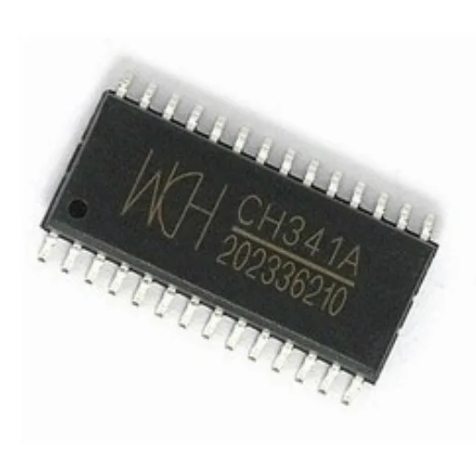
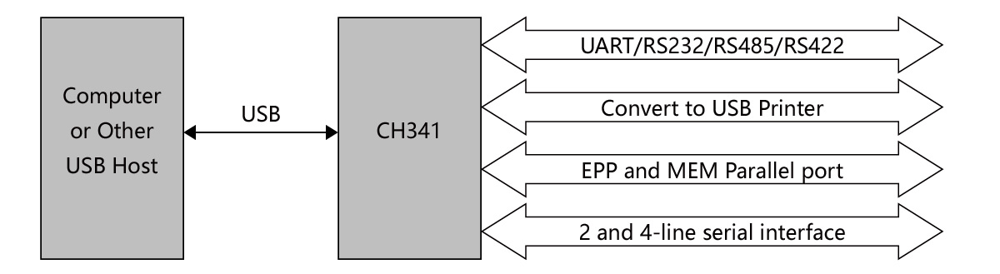
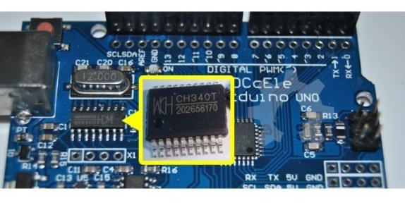
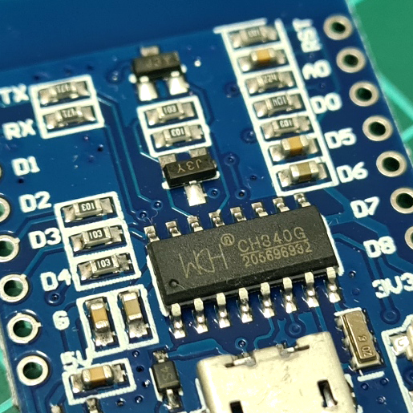
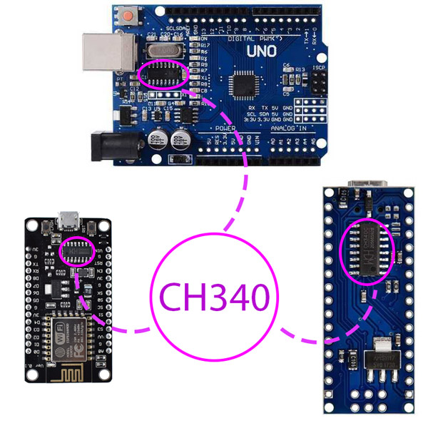

# Apa itu CH340/CH341 USB Interface
apakah kalian pernah mendengar nama ic `ch340/ch341`, jika kalian sering mendengar atau tidak asing dengan nama ic tersebut maka kalian termasuk penghobi elektro atau robotik.

pasalnya ic tersebut kerap kali terlekat dengan sebuah mikrokontroler esp32, esp8266 atau bahkan arduino cloned lainnya. [baca selengkapnya tentang arduino cloned](/pustaka/apa )

tidak perlu berlama lama, berikut adalah penampakan dari gambar fisik IC tersebut

fungsinya untuk apa ? untuk menjawab pertanyaan ini mari kita lihat diagram daripada IC ini dengan seksama

apakah kalian melihatnya ?
kegunaan ch341 adalah sebagai jalur penghubung komunikasi antara komputer(menggunakan usb) dengan perangkat atau modul khusus yang menggunakan aturan komunikasi antara lain:
1. [UART <-baca selengkapnya klik link berikut](/pustaka/mengenal%20berbagai%20jenis%20jalur%20komunikasi%20data/UART/README.md)
2. [I2C <-baca selengkapnya klik link berikut](/pustaka/mengenal%20berbagai%20jenis%20jalur%20komunikasi%20data/I2C/README.md)

dengan demikian maka tidak heran jika saja pada arduino kita(terutama cloned) sering terdapat IC ini:

1. ch340 pada arduino uno

2. ch340 pada wemos d1 mini

3. ch340 pada arduino uno, NodeMCU esp8266 v1, arduino nano

## artikel terkait
1. apakah arduino cloned artinya arduino kw ?\
[untuk selengkapnya baca apa itu arduino cloned](/pustaka/apa%20itu%20arduino%20cloned/README.md)